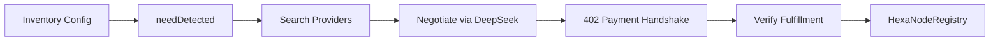

# HexaNode

**Autonomous agent-to-agent procurement clearinghouse** — detects inventory needs, discovers suppliers, negotiates terms, settles via x402 payments, and records settlement on Base Sepolia.

Built for the [Chainlink Convergence Hackathon](https://chain.link/hackathon) — **CRE & AI** track.

---

## Architecture



### Workflow States

| State | Description |
|-------|-------------|
| `needDetected` | Scans inventory for items below threshold (e.g., milk) |
| `search` | Finds providers by product match (config-driven) |
| `negotiate` | LLM (DeepSeek) generates structured terms |
| `payment` | Provider returns 402, workflow pays, provider releases data |
| `verified` | Deterministic checks on fulfillment; optional onchain record |

---

## Chainlink / CRE Files

All Chainlink-relevant files for the hackathon:

| File | Role |
|------|------|
| [project.yaml](project.yaml) | CRE project config, Base Sepolia RPC |
| [secrets.yaml](secrets.yaml) | Secret declarations (CRE_ETH_PRIVATE_KEY, DEEPSEEK_API_KEY) |
| [hexanode-workflow/main.ts](hexanode-workflow/main.ts) | **CRE workflow entry** — orchestration, HTTP, EVM, report |
| [hexanode-workflow/workflow.yaml](hexanode-workflow/workflow.yaml) | Workflow artifacts, config paths |
| [hexanode-workflow/config.staging.json](hexanode-workflow/config.staging.json) | Staging config (inventory, providers, URLs) |
| [contracts/HexaNodeRegistry.sol](contracts/HexaNodeRegistry.sol) | Onchain settlement record |
| [contracts/HexaNodePaymentReceiver.sol](contracts/HexaNodePaymentReceiver.sol) | Real USDC transfers for x402 payments |

---

## Quick Start

### Prerequisites

- [Bun](https://bun.sh) 1.2.21+
- [CRE CLI](https://docs.chain.link/cre/getting-started/cli-installation/macos-linux)
- Chainlink CRE account (`cre login`)
- Funded Base Sepolia wallet (for gas)
- [DeepSeek](https://platform.deepseek.com) API key

### 1. Clone & Install

```bash
git clone https://github.com/SumitShinde0702/HexaNode.git
cd HexaNode
cp .env.example .env
# Edit .env: CRE_ETH_PRIVATE_KEY, DEEPSEEK_API_KEY
```

### 2. Start Provider (x402 supplier)

```bash
cd provider
bun install
bun run start
# Listens on http://localhost:3456
```

### 3. Install Workflow Deps & Simulate

```bash
cd hexanode-workflow
bun install
cd ..
cre workflow simulate hexanode-workflow --target staging-settings
```

### 4. One-Command Demo (PowerShell)

```powershell
.\scripts\simulate.ps1
```

### 5. Web UI (Optional)

```bash
# Terminal 1: API
cd api && npm install && npm start

# Terminal 2: Frontend
cd hexanode-workflow/web && npm install && npm run dev
```

Open http://localhost:5173 — add agents (companies) and inventory. Data is saved to `data/providers.json` and `data/supermarket.json`. Before running the workflow, merge config:

```bash
node scripts/merge-config.js
```

---

## Configuration (No Hardcoding)

All runtime values come from:

- **Environment**: `CRE_ETH_PRIVATE_KEY`, `DEEPSEEK_API_KEY`, `DEEPSEEK_BASE_URL`, `DEEPSEEK_MODEL`
- **Config JSON**: `hexanode-workflow/config.staging.json` — inventory, providers, thresholds, URLs
- **Provider env**: `PROVIDER_PAY_TO`, `PAYMENT_AMOUNT_ATOMIC`, `PORT`

Change `config.staging.json` to alter products, thresholds, or providers without code edits.

---

## Real Base Sepolia USDC Payments

By default the workflow uses a **simulated** tx hash for quick demos. For **real** Base Sepolia USDC transfers:

1. Deploy `HexaNodePaymentReceiver` — see [contracts/README.md](contracts/README.md)
2. Approve USDC from your workflow wallet to the PaymentReceiver
3. Set `paymentReceiverAddress` in `config.staging.json`
4. Run the workflow — it executes a real Base Sepolia transaction and uses that tx hash as the x402 payment proof

---

## Demo Video Checklist

1. Show `milk` below threshold in config
2. Run `cre workflow simulate hexanode-workflow --target staging-settings`
3. Show state logs: needDetected → search → negotiate → payment → verified
4. Highlight 402 response and payment handshake
5. Show final artifact (procurementId, terms, fulfillment, txHash)

---

## License

MIT
